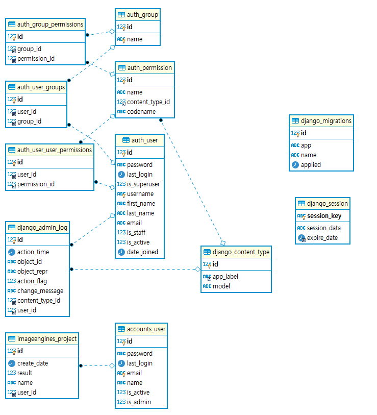
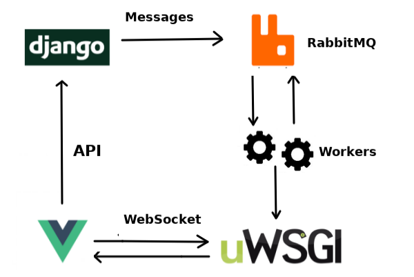

<p align="center">
  
</p>

# Edu_AI

> AI 초입자를 위한, 모두를 위한 AI 학습 플랫폼

## 목차

- [Edu_AI](#edu_ai)
  - [목차](#목차)
  - [:paperclip: 개요](#paperclip-개요)
    - [시연 영상](#시연-영상)
    - [향후 전망](#향후-전망)
  - [:clipboard: 기능](#clipboard-기능)
    - [ERD](#erd)
    - [와이어 프레임](#와이어-프레임)
  - [:gear: 기술 설명](#gear-기술-설명)
    - [시스템 아키텍쳐](#시스템-아키텍쳐)
    - [기술 스택](#기술-스택)
    - [실행방법](#실행방법)
  - [기타](#기타)
    - [참고](#참고)
    - [Samsung Software Academy for Youth 3th Gumi, 자율| 기업연계 프로젝트 D207](#samsung-software-academy-for-youth-3th-gumi-자율-기업연계-프로젝트-d207)
  - [테스트 방법](#테스트-방법)

## :paperclip: 개요

> 저희는 마인즈랩과 기업연계 프로젝트를 진행하였습니다. 높은 자연어처리 기술 구현을 진행하면서, LSTM/ RNN/ attention 메커니즘/ bert등의 난이도 있는 자연어처리 모델들을 구현해 보았습니다. 이러한 어려움들을 통해, 진입장벽이 높은 자연어 처리를 좀 더 쉽게 배울 수 있는 서비스를 만들면 어떨까에 대한 생각에서 시작된 프로젝트입니다. 

<br>

> 기본적으로 저의는 간단한 실습을 통해 코드를 확인해 볼 수 있습니다. 그리고 AI의 기본이라고 할 수 있는 이미지 분류와 자연어 처리에 대해 배워 볼 수 있습니다. 이미지 분류에서는 라이브로 직접 웹캠을 통해 학습을 할 수 있도록 구현하였고, 비교적 난이도 가 있는 자연어 처리에서는 자연어처리의 기본이 되는 모델들을 종류 별로 선택하여 사용할 수 있게 구현할 뿐만 아니라, 기본적으로 영어 전처리가 아닌 한국어 전처리가 가능하도록 구현을 하였습니다.

### 시연 영상
<준비중입니다.>

### 향후 전망
> 1. 코드를 구현하지 않아도 이미지 분류와 텍스트 분류를 실습하고 코드와 결과를 확인 할 수 있습니다. <br> 
> 2. AI를 처음 접한 SSAFY 후배 기수들에게 교보재 용도로 제공합니다. 마지막으로 AI를 tensorflow 튜토리얼을 해보신 분들은 무슨 말인지 쉽게 하기 쉽지 않습니다. <br>
> 3. 저희가 초보자 관점의 기본적인 튜토리얼을 제공하여, AI에 대한 진입 장벽을 낮춰줄 거라 기대합니다.


## :clipboard: 기능

### ERD



### 와이어 프레임

[와이어프레임 링크](doc/산출물/와이어프레임.zip)

## :gear: 기술 설명

| 개발 언어 | 개발 환경 |     API & 라이브러리     |
| :-------: | :-------: | :----------------------: |
|  [Python](https://www.python.org/)   |  [Django](https://www.djangoproject.com/)   |          [TensorFlow /TensorFlow js](https://www.tensorflow.org/?hl=ko)         |
|    JS     |  [Vue.js](https://kr.vuejs.org/)   |            [celery](https://docs.celeryproject.org/)    |
|           |  [MariaDB](https://mariadb.com/)  |          [rabbitmq](https://www.rabbitmq.com/)          |
|           |  [aws EC2](https://aws.amazon.com/)  |    [keras](https://keras.io/)             |
|           |           |   [sklearn](https://scikit-learn.org/stable/)         |
|           |           |   [mecab](https://bitbucket.org/eunjeon/mecab-ko-dic/src/master/)         |


### 시스템 아키텍쳐




### 기술 스택


### 실행방법

1.  Clone the repo

```sh
git clone https://lab.ssafy.com/s03-final/s03p31d207.git --depth 1
cd s03p31d207
```

2. FRONTEND

```sh
  cd /frontend
  npm i
  npm run serve
```

3. BACKEND

```sh
##가상환경 만들기
python -m venv venv

##가상환경 실행
##window
source venv/Scripts/activate
##ubuntu
source venv/bin/activate

##pip upgrade
python -m pip install --upgrade pip

## requirements 설치
pip install -r requirements.txt
pip install pillow

cd backend

python manage.py runserver
```

4. Celery
```sh
cd backend
Celery -A mindlap worker -l info
```
5. uWSGI
```sh
cd backend
uwsgi --http :8000 --gevent 10 --module test --gevent-monkey-patch --master --processes 
```


## 기타

### 참고

- [비동기 통신 예제](https://danidee10.github.io/2018/01/01/realtime-django-1.html)
- [tensorflow CNN으로 사용하기](https://www.notion.so/tensorflow-CNN-d5e816d6a14a4fbabdb17e84db532956)
- [이미지 분류](https://lsjsj92.tistory.com/355)
- [Ubuntu Python Version Update](https://www.notion.so/ubuntu-python-version-update-a9748362a8454661a28643e27a649dfa)

### [Samsung Software Academy for Youth](https://www.ssafy.com/) 3th Gumi, 자율| 기업연계 프로젝트 D207
- `강창현[BackEnd,AI(문장분석)]` - aaakch0316@gmail.com<br>
- `김영민[BackEnd,Frontend]` - kastori1990@gmail.com<br>
- `노우현[BackEnd,AI(Image)]` - ydav2295@gmail.com<br>
- `이예림[FrontEnd]` - yearim.lee15b@gmail.com<br>
- `정성훈[FrontEnd]` - wdtg10211@gmail.com<br>


## 테스트 방법

```
https://k3d207.p.ssafy.io/
email : test@test.com
password : Ssafy207!
```
